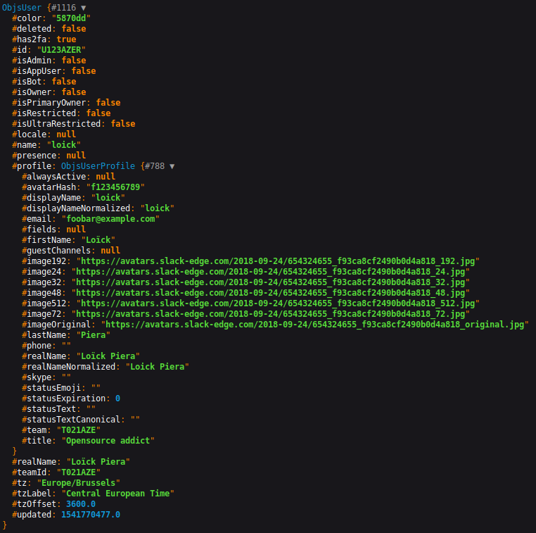

# Usage

## Basic usage of the client

Use the `ClientFactory` to generate a `Client` configured with your token:

```php
<?php

use JoliCode\Slack\Api\Client;
use JoliCode\Slack\ClientFactory;

/** @var Client $client */
$client = ClientFactory::create($yourSlackToken);
```

The client contains all the methods to communicate with Slack API. Checkout its
PHPdoc to know which option you can provide to each method:

```php
<?php
//...

$user = $client->usersInfo(['user' => 'U123AZER'])->getUser();

dump($user);
```

Here is what a User object looks like:

<p align="center">
  
<p>

To summarize - the whole SDK is built with objects. Each endpoints, responses
and models have their own PHP classes with correct typehinting and PHPDoc.

Along with [official Slack documentation](https://api.slack.com/methods), your
favorite PHP editor should be a good ally to explore the whole API.

## Iterating over pagination

Some Slack API endpoints use a cursor based pagination.

In addition to classical methods, our client provides additional virtual methods
to ease the iteration over those endpoints. Those methods can be called by
prefixing the classic method by `iterate`. Here is an example with `usersList()`:

```php
$userNames = [];

/** @var JoliCode\Slack\Api\Model\ObjsUser $user */
foreach ($client->iterateUsersList() as $user) {
    $userNames[] = $user->getName();
}
```

The previous code hide the complexity of working with pagination's cursor. Here
is the equivalent of the previous code:

```php
$userNames = [];
$cursor = '';

do {
    $response = $client->usersList([
        'limit' => 200,
        'cursor' => $cursor,
    ]);

    /** @var JoliCode\Slack\Api\Model\ObjsUser $user */
    foreach ($response->getUsers() as $user) {
        $userNames[] = $user->getName();
    }

    $cursor = $response->getResponseMetadata() ? $response->getResponseMetadata()->getNextCursor() : '';
} while (!empty($cursor));
```

>Note: the virtual methods are not yet documented with PHPDoc so your IDE will
not autocomplete them.

## Concrete examples

Here are some real-life examples of interacting with the SDK:

- [Posting a message in a Slack channel](https://github.com/jolicode/slack-php-api/tree/main/docs/examples/posting-message.php);
- [Retrieving the users in a Slack workspace](https://github.com/jolicode/slack-php-api/tree/main/docs/examples/retrieve-users.php);

## Under the hood

This library mainly contains automatically generated code from the official
[Slack OpenAPI spec](https://github.com/slackapi/slack-api-specs).

Four kinds of PHP classes are included:
- [endpoints](https://github.com/jolicode/slack-php-api/tree/main/generated/Endpoint) represent the requests made to API methods;
- [models](https://github.com/jolicode/slack-php-api/tree/main/generated/Model) represent data exchanged with the API;
- [normalizers](https://github.com/jolicode/slack-php-api/tree/main/generated/Normalizer) transform JSON from the API to PHP models;
- [runtime](https://github.com/jolicode/slack-php-api/tree/main/generated/Runtime) are classes needed to make Jane work.

If you use the `JoliCode\Slack\ClientFactory` to create the Client (which you
should), you don't have to understand how the library works internally.
Calling one of its method will make the HTTP request to the API and return the
corresponding PHP object.

***

Read more:
- Next page: [Troubleshoots](3-troubleshoots.md)
- Previous page: [Get started](1-get-started.md)
